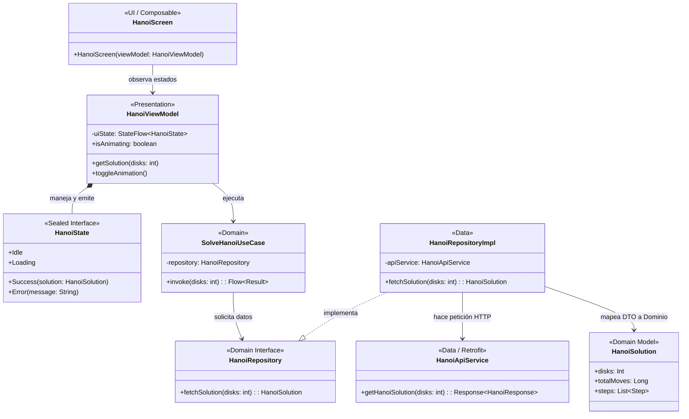

# 🗼 Hanoi Tower Cloud Solver (Android Frontend)

Una aplicación nativa de Android desarrollada con **Jetpack Compose** y **Clean Architecture** que visualiza y resuelve el clásico problema matemático de la Torre de Hanói, delegando el cómputo pesado a un microservicio en la nube.

## 🌟 Características Principales

* **Renderizado Dinámico y Seguro:** Visualización gráfica interactiva para 3-10 discos. Para niveles de alta complejidad computacional (11-50 discos), la app transiciona automáticamente a un "Modo de Alto Rendimiento" (Data-only) para evitar el colapso de la UI y proteger la GPU.
* **Control de Animaciones:** Las animaciones de la IA están impulsadas por **Corrutinas de Kotlin**, permitiendo al usuario pausar o detener la ejecución en cualquier momento (`isAnimating` state flag).
* **Manejo de Big Data:** Implementación de tipos de datos `Long` en las capas de Data y Domain para soportar el cálculo de hasta 50 discos (que genera más de 1.12 cuatrillones de movimientos, superando el límite de 32 bits del `Int`).
* **Estado UI Reactivo:** Patrón UDF (Unidirectional Data Flow) con `StateFlow` y ViewModel para manejar los estados `Idle`, `Loading`, `Success` y `Error`.

## 🛠️ Stack Tecnológico

* **Lenguaje:** Kotlin
* **UI:** Jetpack Compose (Material Design 3)
* **Arquitectura:** MVVM + Clean Architecture
* **Inyección de Dependencias:** Dagger Hilt
* **Asincronía:** Coroutines & Flow
* **Red:** Retrofit + Gson

## 🧠 Límite Arquitectónico
La aplicación limita intencionalmente la entrada a **50 discos** porque $2^{50}-1$ es el límite práctico que puede procesarse instantáneamente sin requerir librerías de `BigInteger` o arquitecturas de streaming paginado desde el backend.

## 🏗️ Diagrama de Arquitectura de Clases

A continuación se detalla la arquitectura Clean Architecture del cliente Android y su interacción con la API en FastAPI.
## 🏗️ Diagrama de Clases (Clean Architecture)

El cliente Android sigue estrictamente los principios de Clean Architecture y el patrón MVI/MVVM, garantizando el desacoplamiento entre la UI, las reglas de negocio y las fuentes de datos.

